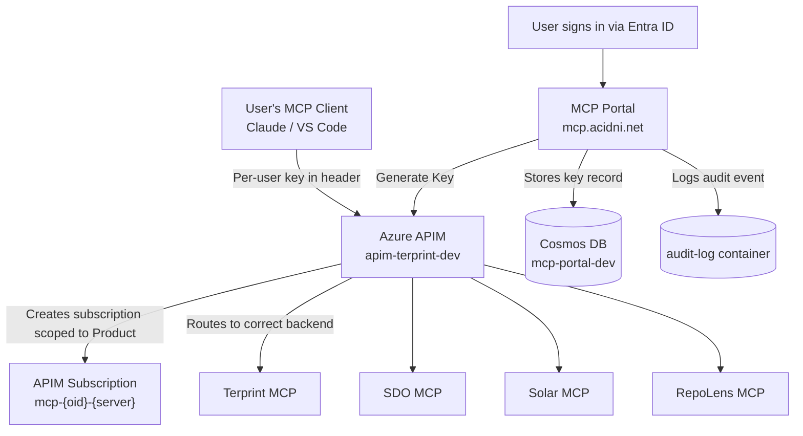

# Acidni MCP Portal

MCP Discovery Portal with **per-user key management** - user dashboard, self-service APIM key lifecycle, and auto-discovery for Acidni MCP servers.

## Features

- **Per-User APIM Keys**: Each user gets unique API keys for every MCP server (no shared keys)
- **Self-Service Key Lifecycle**: Generate, rotate, and revoke keys from the dashboard
- **Audit Trail**: Every key operation logged to Cosmos DB for compliance
- **User Dashboard**: Sign in with Microsoft to view available MCP servers and manage your keys
- **Auto-Discovery**: `/.well-known/mcp` endpoint for MCP clients to auto-discover servers
- **Copy-Paste Configs**: Pre-formatted configurations for Claude Desktop, VS Code, and cURL - personalized with your keys
- **Health Monitoring**: Real-time health status for all registered MCP servers

## Available MCP Servers

| Server | ID | APIM Product | Description |
|--------|----|-------------|-------------|
| 🌿 **Terprint MCP** | `terprint-mcp` | `prod-terprint-mcp` | Cannabis batch data, terpene profiles, inventory analytics |
| 🤖 **AI SDO MCP** | `sdo-mcp` | `prod-sdo-mcp` | CMDB, products, governance, agent config |
| ☀️ **Solar MCP** | `solar-mcp` | `prod-solar-mcp` | Solar monitoring, EG4 inverter data, battery analytics |
| 🔍 **RepoLens MCP** | `repolens-mcp` | `prod-repolens-mcp` | GitHub repo analysis, manifests, CI/CD, PR diffs |

---

## Per-User Key Management

### Why Per-User Keys?

Previously, all users shared the same APIM subscription key per server. This violated **SEC-ASR-003** (per-product APIM subscription keys) and made it impossible to:

- Revoke access for a single user without affecting everyone
- Track which user made which API calls
- Rotate a compromised key without disrupting all users

Now, every user gets their own unique APIM subscription per server, scoped to the correct APIM Product. Keys are created on-demand and can be rotated or revoked independently.

### Architecture



### Key Lifecycle

| Action | What Happens | APIM Effect | Cosmos Effect |
|--------|-------------|-------------|--------------|
| **Generate** | Creates a new APIM subscription scoped to the server's Product | `PUT /subscriptions/{sid}` with `state: active` | Upserts key record in `user-keys` |
| **Rotate** | Regenerates the primary key (old key stops working immediately) | `POST /subscriptions/{sid}/regeneratePrimaryKey` | Updates `key_hint`, increments `rotation_count` |
| **Revoke** | Suspends the subscription (soft-delete, can be re-enabled) | `PATCH /subscriptions/{sid}` with `state: suspended` | Sets `state: revoked`, records `revoked_at` |

### Subscription Naming

APIM subscriptions use a deterministic naming pattern:

```
mcp-{first 12 chars of user OID}-{server-id}
```

Example: `mcp-a1b2c3d4e5f6-terprint-mcp`

This ensures each user+server combination maps to exactly one subscription, and re-generating creates/updates rather than duplicating.

### Data Flow

1. User signs in at **mcp.acidni.net** via Entra ID (MSAL)
2. Dashboard shows all 4 MCP servers with key status (green = active, red = none)
3. User clicks **Generate Key** on a server
4. Portal calls APIM Management API to create subscription scoped to the server's APIM Product
5. Key value is fetched via APIM `listSecrets`
6. Key record (hint + metadata) stored in Cosmos DB `user-keys` container
7. Audit event logged to Cosmos DB `audit-log` container
8. User copies their personalized config (Claude Desktop, VS Code, or cURL) from the server detail page
9. MCP client sends requests with the per-user key in the `Ocp-Apim-Subscription-Key` header
10. APIM validates the key, routes to the correct backend based on Product-to-API mapping

### Shared Keys (Health Checks Only)

The portal still holds shared APIM subscription keys from Key Vault (`apim-*-subscription-key`). These are used **only** for server-side health check proxying (`/api/health/{id}`). They are never exposed to users or included in exported configurations.

---

## Quick Start

### For Users

1. Visit **https://mcp.acidni.net**
2. Sign in with your Microsoft account
3. On the dashboard, click **Generate Key** next to each MCP server you want to use
4. Go to the server detail page and copy your configuration snippet
5. Paste into your MCP client config file

### Configuring Claude Desktop

After generating your keys on the portal, go to each server's detail page. The portal generates a ready-to-paste `claude_desktop_config.json` snippet with your personal key:

```json
{
  "mcpServers": {
    "terprint-mcp": {
      "command": "npx",
      "args": ["-y", "@anthropic-ai/mcp-proxy@latest", "--header",
               "Ocp-Apim-Subscription-Key: YOUR_PERSONAL_KEY_HERE",
               "https://api.acidni.net/terprint-mcp/mcp"]
    }
  }
}
```

Each server gets its own unique key. Do **not** reuse your old shared keys - generate fresh per-user keys from the portal.

### Configuring VS Code

The portal also generates VS Code MCP settings. Copy from the server detail page:

```json
{
  "mcp": {
    "servers": {
      "terprint-mcp": {
        "type": "sse",
        "url": "https://api.acidni.net/terprint-mcp/mcp",
        "headers": {
          "Ocp-Apim-Subscription-Key": "YOUR_PERSONAL_KEY_HERE"
        }
      }
    }
  }
}
```

### Auto-Discovery (for MCP clients)

MCP clients can discover available servers via:

```
GET https://mcp.acidni.net/.well-known/mcp
```

---

## API Endpoints

### Portal & Web

| Endpoint | Auth | Description |
|----------|------|-------------|
| `GET /` | No | Landing page |
| `GET /dashboard` | Yes | User dashboard with key status per server |
| `GET /server/{id}` | Yes | Server details with key management + config snippets |
| `GET /.well-known/mcp` | No | MCP discovery manifest |
| `GET /health` | No | Portal health check |

### Data API

| Endpoint | Auth | Description |
|----------|------|-------------|
| `GET /api/servers` | Optional | List all servers (includes `has_key` per user) |
| `GET /api/configs/claude-desktop` | Yes | Full Claude Desktop config with per-user keys |
| `GET /api/configs/vscode` | Yes | Full VS Code config with per-user keys |
| `GET /api/health/{id}` | No | Proxied server health check (uses shared key) |

### Key Management API

| Endpoint | Auth | Description |
|----------|------|-------------|
| `GET /api/keys` | Yes | List all key records for the current user |
| `POST /api/keys/{server_id}` | Yes | Generate a new per-user key for a server |
| `POST /api/keys/{server_id}/rotate` | Yes | Rotate (regenerate) the user's key |
| `DELETE /api/keys/{server_id}` | Yes | Revoke (suspend) the user's key |

---

## Infrastructure

### Azure Resources

| Resource | Type | Resource Group |
|----------|------|----------------|
| `ca-mcp-portal` | Container App | `rg-dev-acidni-shared` |
| `apim-terprint-dev` | API Management | `rg-terprint-apim-dev` |
| `acidni-cosmos-dev` | Cosmos DB | `rg-acidni-shared-dev` |
| `kv-terprint-dev` | Key Vault | `rg-terprint-dev` |

### Cosmos DB

| Property | Value |
|----------|-------|
| Account | `acidni-cosmos-dev` |
| Endpoint | `https://acidni-cosmos-dev.documents.azure.com:443/` |
| Database | `mcp-portal-dev` |
| Container: `user-keys` | Partition key: `/user_oid` |
| Container: `audit-log` | Partition key: `/user_oid` |

### APIM Products

Each MCP server maps to an APIM Product. Per-user subscriptions are scoped to these products, so APIM handles routing to the correct backend APIs automatically.

| Server ID | APIM Product |
|-----------|-------------|
| `terprint-mcp` | `prod-terprint-mcp` |
| `sdo-mcp` | `prod-sdo-mcp` |
| `solar-mcp` | `prod-solar-mcp` |
| `repolens-mcp` | `prod-repolens-mcp` |

### Required RBAC Role Assignments

The Container App's managed identity (`ca-mcp-portal`) needs:

| Resource | Role | Purpose |
|----------|------|---------|
| `apim-terprint-dev` | `API Management Service Contributor` | Create/manage per-user subscriptions |
| `acidni-cosmos-dev` / `mcp-portal-dev` | `Cosmos DB Built-in Data Contributor` | Read/write key records and audit logs |
| `kv-terprint-dev` | `Key Vault Secrets User` | Read shared keys and auth secrets |

---

## Development

### Prerequisites

- Python 3.12+
- Azure CLI (for Key Vault and managed identity access)

### Local Setup

```bash
# Clone the repository
git clone https://github.com/Acidni-LLC/acidni-mcp-portal.git
cd acidni-mcp-portal

# Create virtual environment
python -m venv venv
venv/Scripts/Activate.ps1  # Windows
source venv/bin/activate   # Linux/Mac

# Install dependencies
pip install -e ".[dev]"

# Create .env file
cat > .env << EOF
ENVIRONMENT=development
DEBUG=true
KEYVAULT_NAME=kv-terprint-dev
EOF

# Run locally
python -m src.main
```

### Environment Variables

| Variable | Description | Default |
|----------|-------------|---------|
| `ENVIRONMENT` | development / production | development |
| `DEBUG` | Enable debug mode | false |
| `KEYVAULT_NAME` | Azure Key Vault name | kv-terprint-dev |
| `SECRET_KEY` | Session encryption key | (loaded from KV) |

### Key Vault Secrets

| Secret | Purpose |
|--------|---------|
| `azure-tenant-id` | Entra ID tenant |
| `mcp-portal-client-id` | App registration client ID |
| `mcp-portal-client-secret` | App registration client secret |
| `mcp-portal-session-secret` | Session encryption key |
| `apim-terprint-mcp-subscription-key` | Shared key - health check proxying only |
| `apim-sdo-mcp-subscription-key` | Shared key - health check proxying only |
| `apim-solar-mcp-subscription-key` | Shared key - health check proxying only |
| `apim-repolens-mcp-subscription-key` | Shared key - health check proxying only |

### Project Structure

```
src/
  main.py                  # FastAPI app, lifespan init for Cosmos + APIM manager
  config.py                # Settings loaded from env + Key Vault
  auth.py                  # Entra ID / MSAL authentication
  registry.py              # MCP server registry (static catalog)
  routes/
    __init__.py             # Exports api_router, keys_router, web_router
    api.py                  # Data API routes (servers, configs, health proxy)
    keys.py                 # Key lifecycle API (generate, rotate, revoke)
    web.py                  # HTML page routes (dashboard, server detail)
  services/
    key_manager.py          # APIM Management REST API client
    cosmos_client.py        # Cosmos DB user-keys + audit-log client
  templates/
    dashboard.html          # Dashboard with key status + HTMX key management
    server_detail.html      # Server detail with key display + config snippets
    ...
```

## Deployment

Deployed via GitHub Actions to Azure Container Apps:

- **Container App**: `ca-mcp-portal`
- **Resource Group**: `rg-dev-acidni-shared`
- **Custom Domain**: `mcp.acidni.net`
- **ACR Image**: `cracidnidev.azurecr.io/acidni-mcp-portal`

---

## Security

- **No shared keys for user access** - every user gets unique APIM subscription keys (SEC-ASR-003)
- **APIM validates all requests** - MCP servers are behind internal ingress, only reachable via APIM (SEC-ASR-001)
- **Managed identity everywhere** - portal uses `DefaultAzureCredential` for APIM, Cosmos, and Key Vault
- **Audit logging** - every key create/rotate/revoke is logged to Cosmos DB with user OID, email, timestamp
- **Soft-delete on revoke** - subscriptions are suspended, not destroyed, allowing forensic review
- **Key hints only in Cosmos** - only the last 4 characters are stored; APIM is the source of truth for full key values

## License

Proprietary - Acidni LLC
